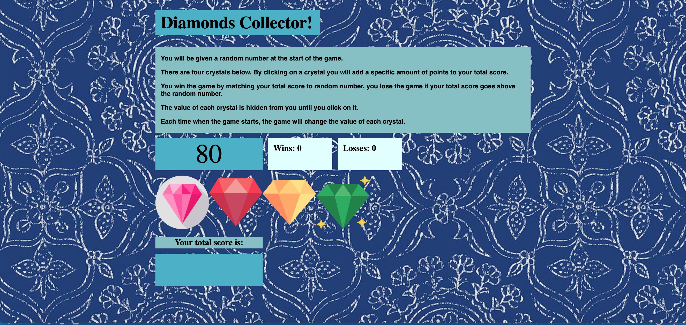

# Diamonds :diamonds: Collector Game

### Welcome to the diamonds collector game! Here, the goal of the game is to get your score to match the target score. 

#### Note the following items:
- The target score is a number between 19-120 and changes everytime you lose or win the game. 
- The player score is a number between 1-12 and the value of each gem has been randomly assigned at the start of the game. 
- The player increases his or her score by clicking on the gems. 

#### At the start of the game, the player will see the following screen: 

#### The below demo is an example of how the player wins the game by inceasing their score to match the target score. 

#### The below demo is an example of how the player can lose the game by inceasing their score to be higher than the target score. 

## Deployed Site
Use this link to see the deployed site:  https://jerpowel321.github.io/unit-4-game/

## Built With
- HTML
- CSS
- JavaScript
- JQuery

## Authors
Jennifer Powell 